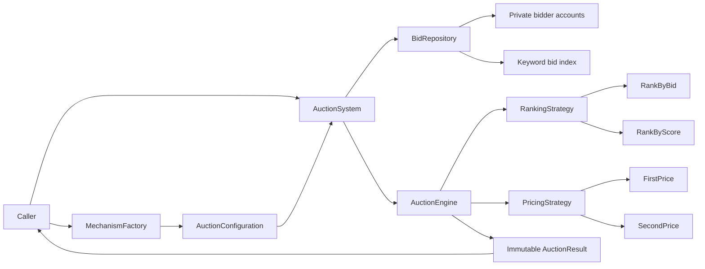
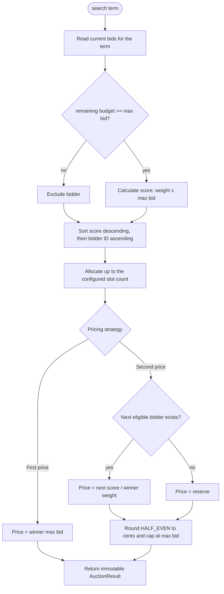
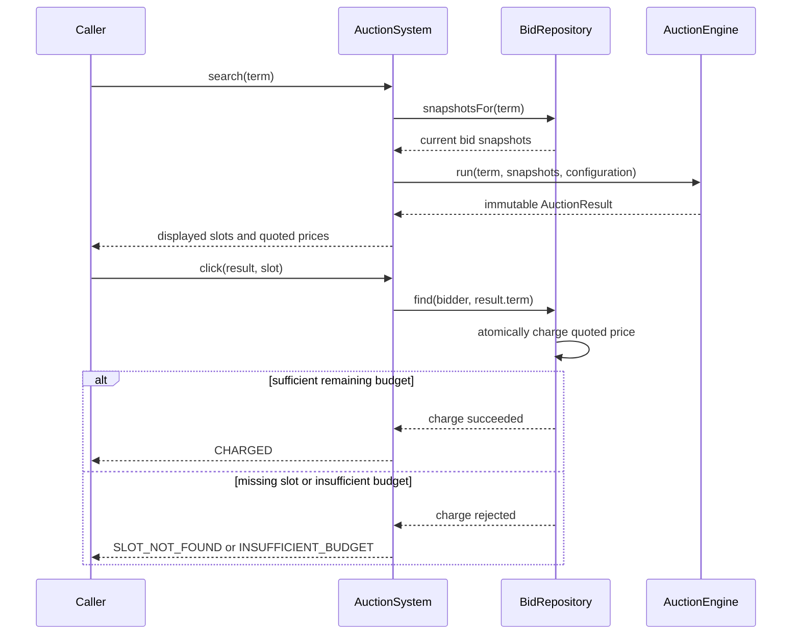
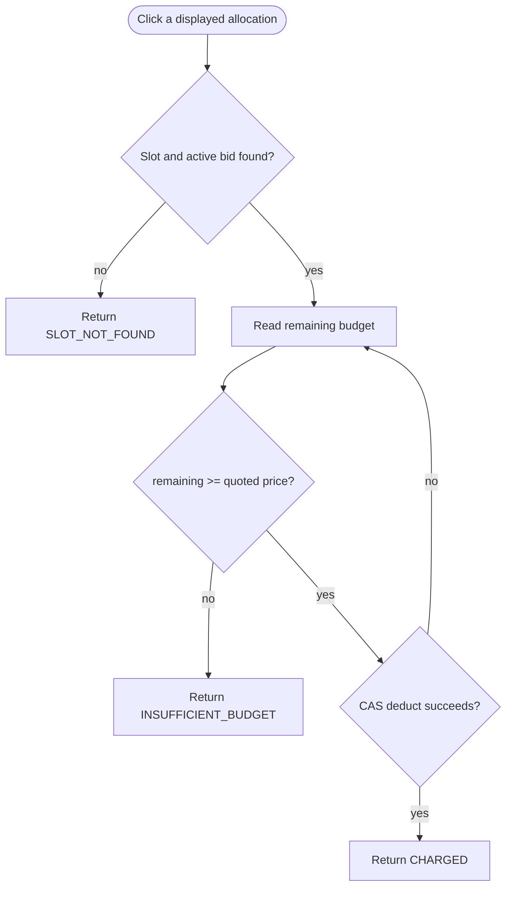

# Sponsored Search Auctions

A small Java 17 domain model for per-keyword sponsored-search auctions. It implements every required combination of ranking and pricing, runs a new auction on each search, and charges only after a click.

## Build and test

The assessment environment needs JDK 17 and Maven installed.

```bash
mvn test
```

The Maven suite contains focused unit tests for money, ranking, pricing, allocation, factory wiring, concurrent charging, and end-to-end `AuctionSystemTest` scenarios. Compilation uses `-Xlint:all -Werror`, so compiler warnings fail the build.

## Domain model

- `Money` stores a non-negative exact cent value in a `long`.
- `AuctionSystem` registers and updates the one active bid for each `(bidder, search term)`, searches, and charges clicks.
- `AuctionConfiguration` is immutable and fixes the auctioneer's mechanism, slot count, reserve, and score weights before use.
- `AuctionEngine` owns the fixed flow: filter eligible bids, rank, allocate, and price.
- Ranking and pricing are sealed strategies selected by `MechanismFactory`.

`AuctionResult` and `Allocation` are immutable. A click is made against a displayed result and slot, so it uses the price the user was shown:

```java
AuctionResult result = system.search(new SearchTerm("flights"));
ClickOutcome outcome = system.click(result, new Slot(1));
```

`ClickOutcome` reports `CHARGED`, `SLOT_NOT_FOUND`, or `INSUFFICIENT_BUDGET`. `remainingBudget` is a read-only query intended for verification and integration.

## System architecture



`AuctionSystem` is the public application service. `BidRepository` owns mutable bid state and indexes the same active bids by bidder and keyword. The engine is stateless: configuration selects the ranking and pricing strategies before searches begin.

## Auction evaluation flow



The engine prices a winner against the entire ranked eligible list, including the first losing bidder. This is why a one-slot GSP auction can still charge the winning bidder using a losing bid.

## Mechanisms

The factory supports these combinations:

| Mechanism | Ranking | Per-click price |
| --- | --- | --- |
| `RANK_BY_BID_FIRST_PRICE` | `score = bid` | winner's bid |
| `RANK_BY_BID_SECOND_PRICE` | `score = bid` | next bidder's bid |
| `RANK_BY_SCORE_FIRST_PRICE` | `score = weight * bid` | winner's bid |
| `RANK_BY_SCORE_SECOND_PRICE` | `score = weight * bid` | `nextScore / currentWeight` |

Scores are sorted descending, then by ascending bidder ID for deterministic ties. GSP computes with `BigDecimal`, rounds once to cents using `HALF_EVEN`, and caps the result at the winner's max bid. The final allocated bidder pays the reserve when no eligible bidder is below them; the default reserve is zero.

## Worked examples

These examples use three slots and are also asserted by the Maven tests.

- **Rank by bid + GFP:** A bids $5, B $3, C $2, and D $1. The winners are A, B, C and pay $5, $3, $2 respectively.
- **Rank by bid + GSP:** With the same bids, A, B, C win and pay the next bids: $3, $2, $1.
- **Rank by score + GFP:** A is `(weight 1, bid $4)`, B is `(2, $3)`, and C is `(0.5, $10)`. Scores rank B, C, A; they pay $3, $10, $4 respectively.
- **Rank by score + GSP:** With those weights and bids, B pays `5 / 2 = $2.50`, C pays `4 / 0.5 = $8.00`, and last-place A pays the zero default reserve.
- **Budget lifecycle:** B starts with $10 in the score/GSP example. Four $2.50 clicks exhaust its budget; the next search excludes B and re-ranks the remaining bidders.

## Search and click interaction



## Budget safety

A bid participates only when its current remaining budget is at least its maximum bid. GFP charges exactly that bid; GSP is capped at it. Therefore a winner selected for an auction can never be charged more than their eligible budget for a single click.

Each remaining budget is an `AtomicLong`. Click charging uses a compare-and-set loop, which prevents concurrent clicks from making an individual bid negative. Full serialization between a concurrent search, bid update, and configuration update is deliberately out of scope.



The concurrent-click test submits 200 simultaneous click attempts against a $100 budget with a $1 quoted price. Exactly 100 clicks charge, 100 are rejected, and the remaining budget is zero.

## Scope boundaries

This project intentionally omits a UI, REST API, database, continuous budget pacing, CTR/revenue modelling, VCG, and post-creation configuration changes. An unknown term produces an empty `AuctionResult`; showing an ad without calling `click` has no budget effect.
